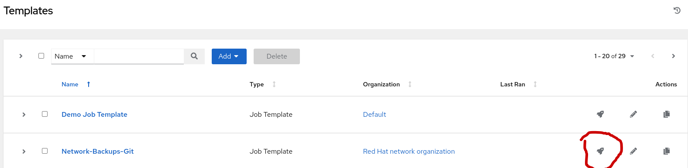
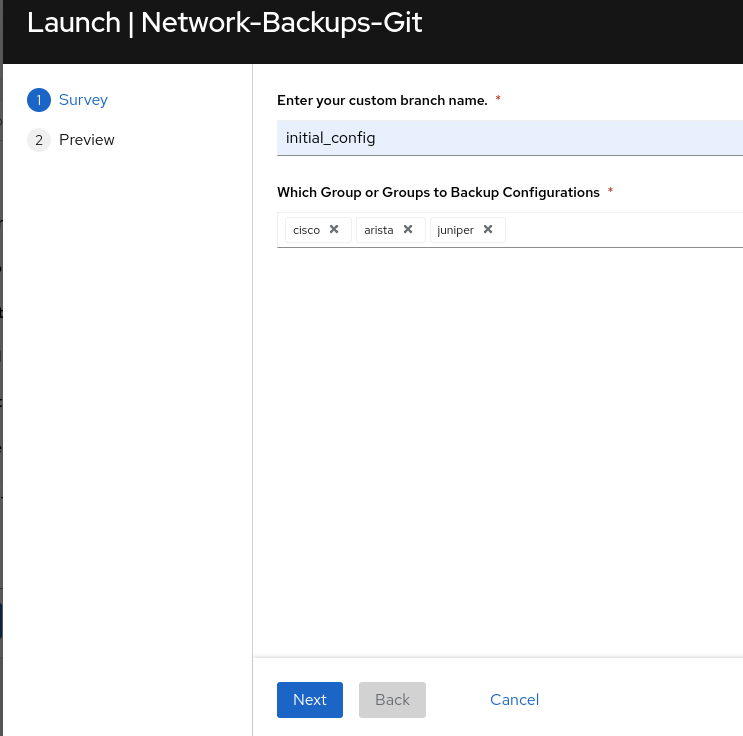
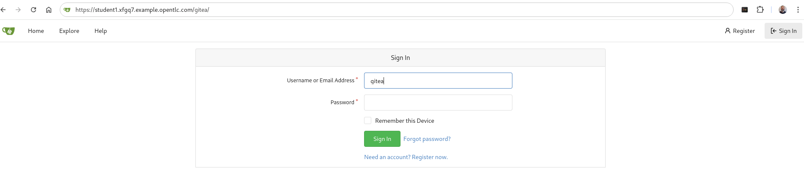
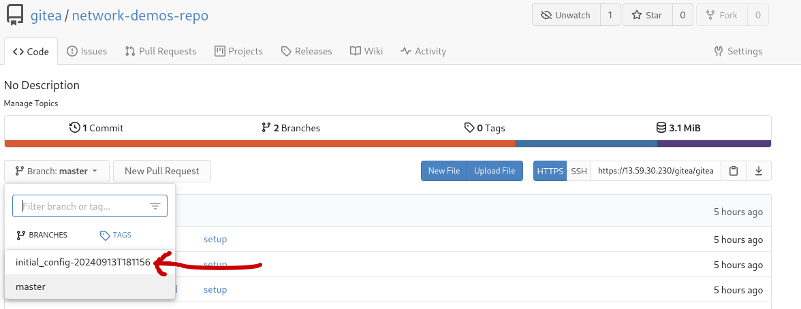
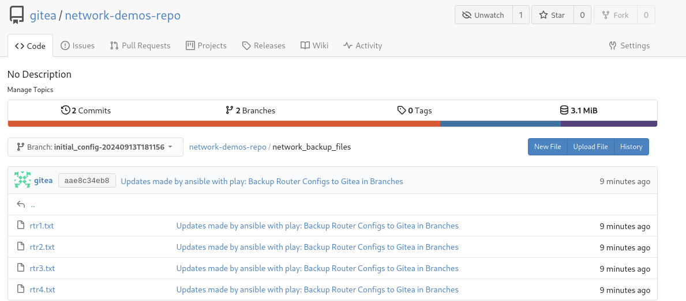

## Return to Menu
 - [Menu of Exercises](../README.md)

# Summary of steps
1. Collect Backup configurations from routers and save them to Gitea branches
2. Verify Branches in the local GIT and Gitea GUI


# Exercise-1 Backups as Code

[Table of Contents](#table-of-contents)
- [Step 1 - Collect Backup Configurations](#step-1---collect-backup-configurations)
- [Step 2 - Review Branches](#step-2---review-branches)

## Objective
To enable multi-vendor router configuration backups to Gitea.

## Overview
This demo uses the ansible.scm collection along with the network.backup role from Validated Content Collection called `network.backup`. This collection is used to backup router configurations to git branches in the Gitea repo. 

### Step 1 - Collect Backup Configurations
Access your AAP Controller from your RHDP POD and run the 'Network-Backups-Git' job template. The survey will prompt for optionally naming your branch or inserts default branch naming when ignored. For this exercise, when prompted, name your backup branch `initial_config`

1. Launch the Network-Backups-Git' job template



2. Complete the survey for the backup branch and device groups

* remember to click next

Example Output - Network-Backups-Git `backups.yml` with explanations
```
Identity added: /runner/artifacts/404/ssh_key_data (/runner/artifacts/404/ssh_key_data)

PLAY [Backup Cisco Configs to Gitea in Branches] *******************************

TASK [Retrieve a repository from a distant location and make it available to the local EE] ***
changed: [localhost] 
```
`The above task uses `ansible..scm.git_retrieve` to clone the network-demos-rep from the gitea repository to the execution environment.`
```
TASK [Network Backup and Resource Manager] *************************************
```
`The following tasks are run using the network.backup.run role. Note that the tasks are accessed from the path (/usr/share/ansible/collections/ansible_collections/network/backup/roles/). This path refers to the validated collection that was installed into the execuion environment.`
```
TASK [network.backup.run : Include tasks] **************************************
included: /usr/share/ansible/collections/ansible_collections/network/backup/roles/run/includes/validation.yaml for rtr1, rtr2, rtr4, rtr3

TASK [network.backup.run : Set supported platform list] ************************
ok: [rtr1]
ok: [rtr3]
ok: [rtr4]
ok: [rtr2]

TASK [network.backup.run : Run the platform specific tasks] ********************
included: run/includes/backup.yaml for rtr1, rtr2, rtr4, rtr3 => (item=/usr/share/ansible/collections/ansible_collections/network/backup/roles/run/includes/backup.yaml)

TASK [network.backup.run : Build Local Backup Dir Path] ************************
included: /usr/share/ansible/collections/ansible_collections/network/backup/roles/run/includes/path.yaml for rtr2, rtr1, rtr4, rtr3

TASK [network.backup.run : Set local backup path] ******************************
ok: [rtr4]
ok: [rtr1]
ok: [rtr2]
ok: [rtr3]

TASK [network.backup.run : Include tasks] **************************************
included: /usr/share/ansible/collections/ansible_collections/network/backup/roles/run/includes/network.yaml for rtr1, rtr2, rtr4, rtr3

TASK [network.backup.run : Invoke backup task] *********************************
included: /usr/share/ansible/collections/ansible_collections/network/backup/roles/run/includes/cli_backup.yaml for rtr1, rtr2, rtr4, rtr3

TASK [network.backup.run : configurable backup path] ***************************
changed: [rtr1]
changed: [rtr3]
changed: [rtr2]
changed: [rtr4]
```
`The above backup path is defined in the backup.yml playbook`
```
TASK [Publish the changes] *****************************************************
changed: [localhost]
```
`The above task will push the backup files from the EE to the Gitea repository`
```
PLAY [Prepare Branches for Intent and Restore] *********************************
```
`The above play will create/edit two job-templates (intended,restore) in the AAP controller`
```
TASK [Retrieve a repository from a distant location and make it available to the local EE] ***
changed: [localhost]

TASK [List the Branches] *******************************************************
changed: [localhost]

TASK [Create a job-template - Network-Git-Intent] ******************************
changed: [localhost]

TASK [Create a job-template - Network-Git-Restore] *****************************
changed: [localhost]

PLAY RECAP *********************************************************************
localhost                  : ok=6    changed=6    unreachable=0    failed=0    skipped=1    rescued=0    ignored=0   
rtr1                       : ok=8    changed=1    unreachable=0    failed=0    skipped=11   rescued=0    ignored=0   
rtr2                       : ok=8    changed=1    unreachable=0    failed=0    skipped=9    rescued=0    ignored=0   
rtr3                       : ok=8    changed=1    unreachable=0    failed=0    skipped=9    rescued=0    ignored=0   
rtr4                       : ok=8    changed=1    unreachable=0    failed=0    skipped=9    rescued=0    ignored=0   
```
### Step 2 - Review Branches
Note, the following steps provide the gitea gui/web.
Simply open a tab and paste in your lab url and modify it to append `/gitea`
#### For example:
```
https://student1.hjjzl.example.opentlc.com/gitea
user= gitea
password = gitea
repo= https://student1.hjjzl.example.opentlc.com/gitea/gitea/network-demos-repo
```  
The above would require you to use your `assigned` student number and lab number not `student1.hjjzl`



- Navigate to your branch and find the network_backup_files folder. From here you can review the backups for the router configuration files.



- Review the network_backup_files folder and backup files



- rtr1.txt
~~~
### Cat a config file to review
~~~ 
~~~
Building configuration...

Current configuration : 7798 bytes
!
! Last configuration change at 15:57:02 UTC Mon Jan 29 2024 by ec2-user
!
version 17.6
service timestamps debug datetime msec
service timestamps log datetime msec
~~~
Truncated

## Caution
Do not delete your initial_config branch! We will use this branch again in a later exercise for Config Drift Checks and Restorals. 

# Key Takeaways
* The network.backup.run validated role backups router configs to Git using branches.
* The role uses remote SCM parameters, if more flexibility is needed than adjust git parameters dirrectly from the ansible.scm collection (we did the latter)

## Return to Exercise Menu
 - [Menu of Exercises](../README.md)
