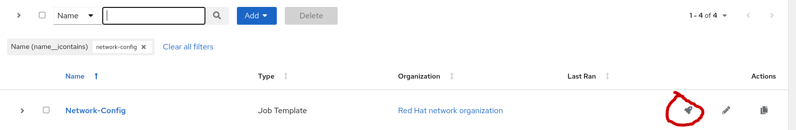
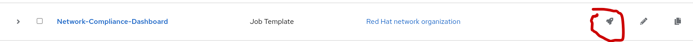
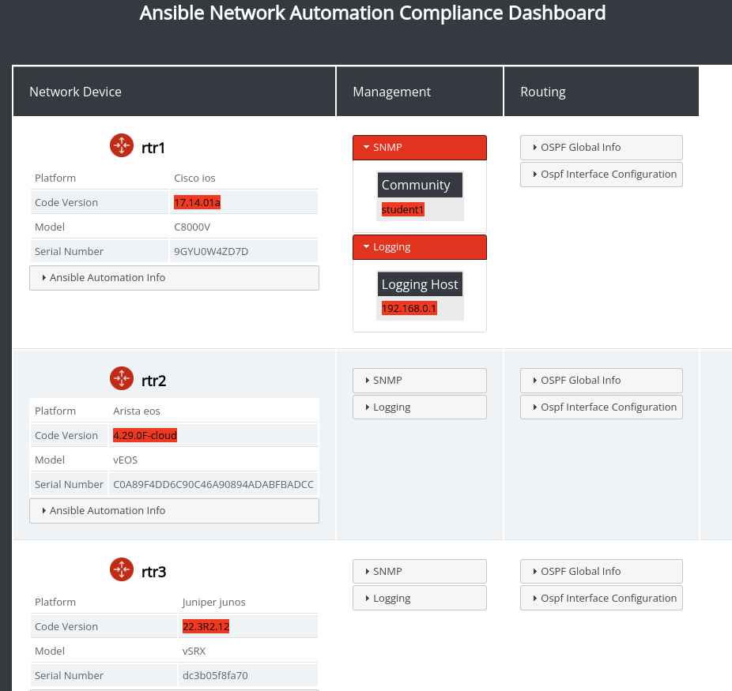
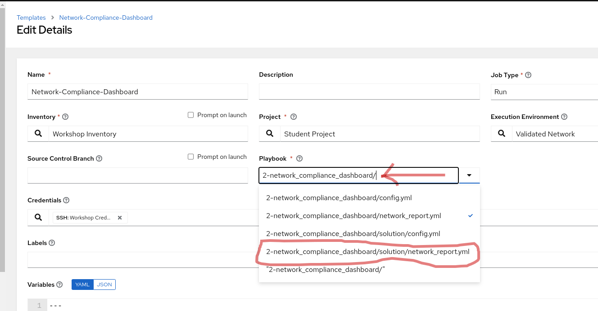
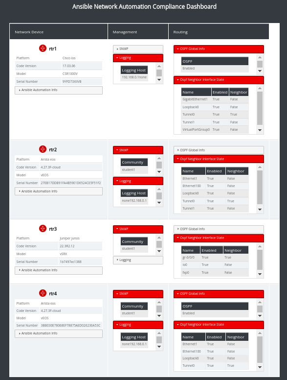
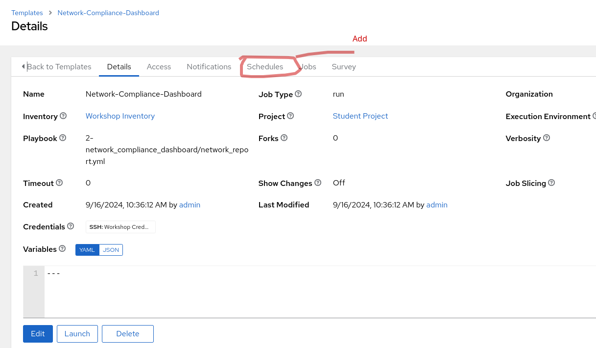
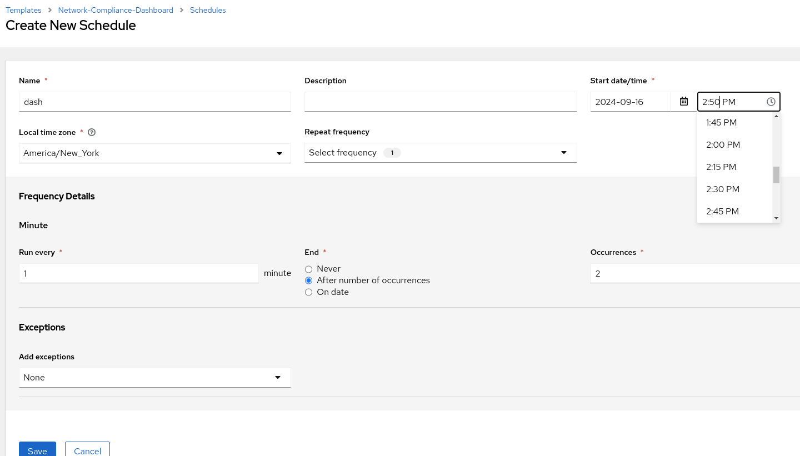
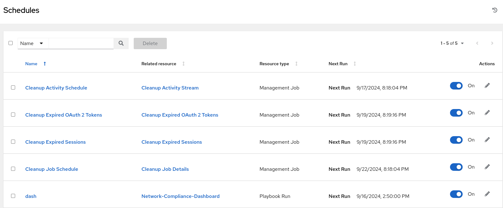
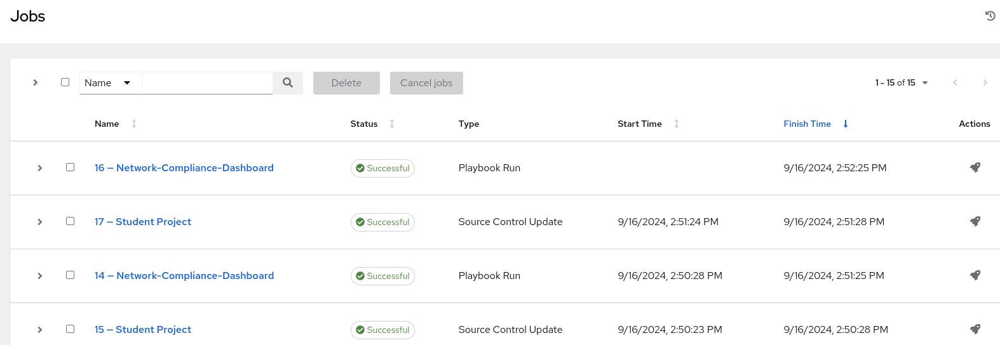

## Return to Menu
 - [Menu of Exercises](../README.md)

# Summary of steps
1. Deploy a Podman container with nginx for a dashboard
2. Create some configurations for devices 
3. Use Network facts to create dynamic documentation
4. Compare desired configurations in a jinja2 html template
5. Mark in `red` any compliance violations displayed on the dashboard
6. Resolve compliance conficts
7. Update Dashboard
8. Optional - Create a schedule to automatically update the dashboard

# Exercise 2 - Network Compliance Dashboard

  [Table of Contents](#table-of-contents)
  - [Step 1 - Run the Network-Config](#step-1---run-the-network-config)
  - [Step 2 - Run the Network-Compliance-Dashboard](#step-2---run-the-network-compliance-dashboard)
  - [Step 3 - Display the Dashboard](#step-3---display-the-dashboard)
  - [Step 4 - Review the files for the Dashboard](#step-4---review-the-files-for-the-dashboard)
  - [Step 5 - Change the Variables](#step-5---change-the-variables)
  - [Step 6 - Run again](#step-6---run-again)
  - [Step 7 - Optional Challenge](#step-7---optional-challenge)

## Objective
Create a web based compliance dashboard and update changes using Ansible. 

## Overview
In this exercise you will explore a `jinja2` template that collects compliance focused data using network `facts`. Compliance violations are highlighted in red. 
For this demo we will also utilize a role to install a podman container with a nginx web service to view our dashboard by accessing the lab pod's public IP Address with tcp port 8088. As an optional bonus this job-template can be launched from a job scheduler; in order to periodically update the dashboard.   

### Step 1 - Run the Network-Config
This job-template will run a playbook to configure some router items that fall under the scope of compliance. Please note, without running this playbook first the dashboard will fail!
Fyi, to easily find the Network-Config template, use the search field.

### Step 2 - Run the Network-Compliance-Dashboard

Copy the IP address for the dashboard in the job output. Copying with `Control C` works best here.

`example output`
~~~
TASK [../roles/build_report_container : Display link to inventory report] ******
ok: [ansible-1] => {
    "msg": [
        "Please go to http://18.221.253.245:8088"
~~~

### Step 3 - Display the Dashboard
Open a tab from your own browser and paste the url from the previous step. You will see the dashboard highlighted in red for elements that are out of compliance.Take a few minutes to explore the dashboard and associated dropdown menus to locate any compliance issues.

### Step 4 - Review the files for the Dashboard

~~~
 $ cat 2-network_compliance_dashboard/roles/build_report_container/templates/report.j2
~~~

 Note, that the `mark` tag is used to highlight elements that are not in compliance. Notice how the mark is used in the following example.

~~~
<td class="sub_net_info"><mark>{{hostvars[network_switch]['ansible_net_version']}}</mark><mark>{{hostvars[network_switch]['ansible_net_version']}}</mark><mark>{{hostvars[network_switch]['ansible_net_version']}}</mark>{{hostvars[network_switch]['ansible_net_version']}}</td>
~~~     
         
 The vars/main.yml file includes the `desired_ios_version` and other variables used for the `jinja2` configuration.
- The file is located here: `network_compliance_dashboard/roles/build_report_container/vars/main.yml`

 ~~~
desired_ios_version: "17.03.06"
desired_eos_version: "4.27.1F-cloud"
desired_junos_version: "22.3R2.11"
desired_snmp: "student2"
desired_logging_host: "192.168.0.254"
~~~

This is the current contents of the network_report.yml playbook. Please note the two roles 
that are included:
* facts
* build_report_container

`2-network_compliance_dashboard/network_report.yml`
~~~
---
- name: Compliance Dashboard
  hosts: network
  gather_facts: false
  
  tasks:
    - name: Load read facts role
      ansible.builtin.include_role:
        name: "../roles/facts"

- name: Build report with facts
  hosts: ansible-1
  become: true
  gather_facts: false

  tasks:

    - name: Build a report
      ansible.builtin.include_role:
        name: "../roles/build_report_container"
~~~

### Step 5 - Change the Variables
The variables for the desired configs can be changed by running the solution. The solution changes the network_report.yml playbook to the a file with updated variables. In order to do this, return to the Network-Compliance-Dashboard job-template and edit the playbook field. It's easier to navigate, if you backspace in the playbook rearch field . See below..

In the solution, the variables are defined with the correct values.

~~~
desired_ios_version: "17.14.01a"
desired_eos_version: "4.29.0F-cloud"
desired_junos_version: "22.3R2.12"
desired_snmp: "student1"
~~~

* The variables are located here:
~~~
/home/tdubiel/code/multi-vendor-network-workshop/2-network_compliance_dashboard/solution/roles/build_report_container/vars
~~~

### Step 6 - Run again
Run the `Network-Compliance-Dashboard` job-template and reload the dashboard tab on your browser.
* Note, at this point no red highlights are displayed because all configurations are compliant.
- note the url-ip address for the dashboard in the job output.

### Step 7 - Optional Challenge
Create a schedule in the AAP controller to run the Network-Compliance-Dashboard job-template periodically. 

1. Add a schedule to the Network-Compliance-Dashboard job-template

2. Set the schedule to start based on your local time (like a few minutes from now ) and to run every minute for two iterations. 

3. Validate that the schedule for the `dash` is added to the list of schedules.

4. Wait (a few minutes) and then check the jobs output to validate the schedule ran the Network-Compliance-Dashboard job-template twice sucessfully. 

## Key Takeaways
* Network Facts are an easy method to discover and evaluate the configurations from network devices.
* Dashboards and Reports are easy to populate with Network Facts
* The html template is easy to modify
* This repository includes roles for customizing dashboards.
  Customize the Dash: https://github.com/zjleblanc/zjleblanc.reporting/tree/master/zjleblanc/reporting/roles/cisco_facts

## Return to Exercise Menu
 - [Menu of Exercises](../README.md)

