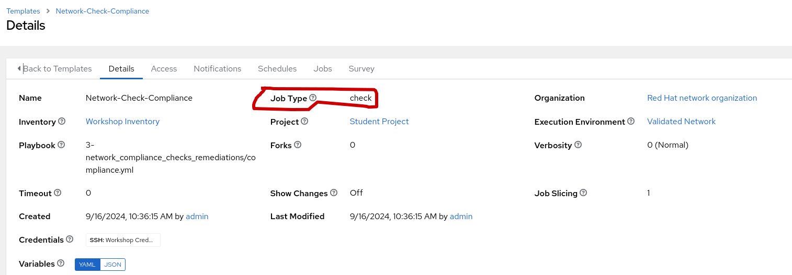
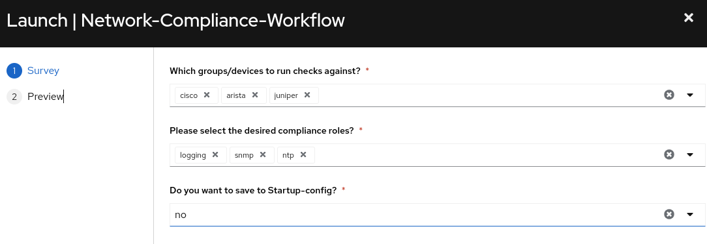
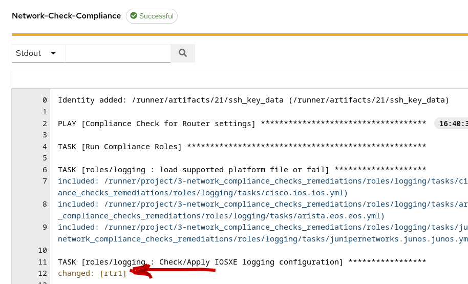
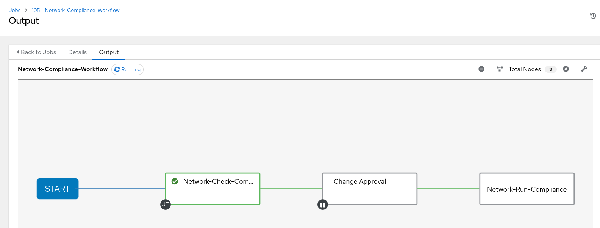
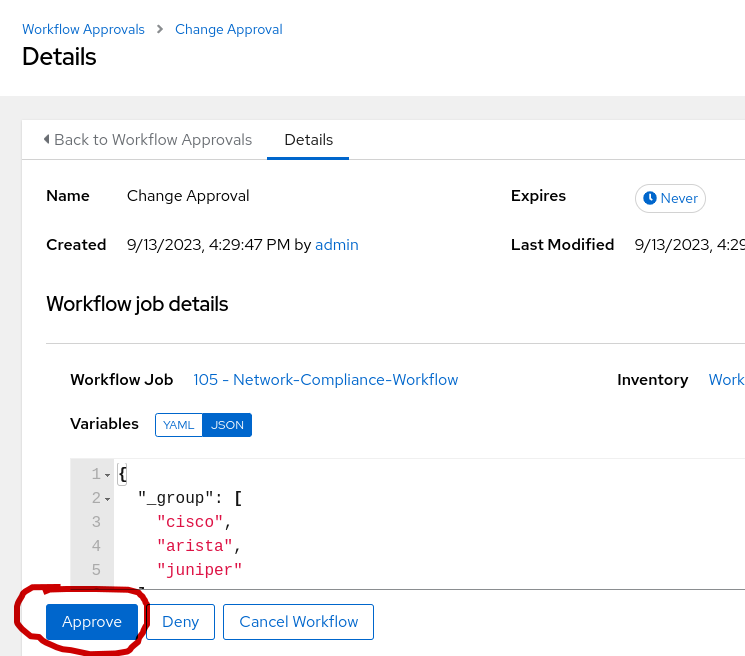
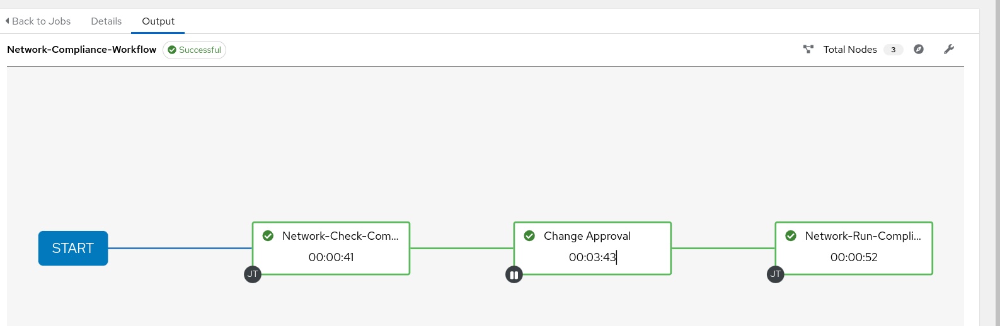
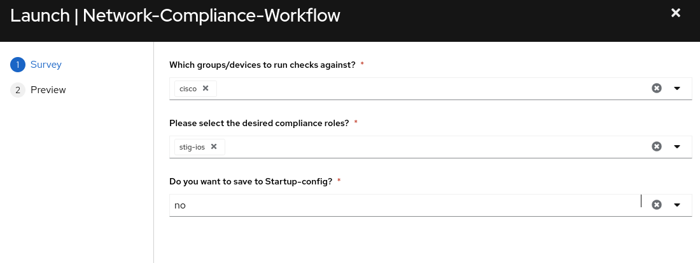
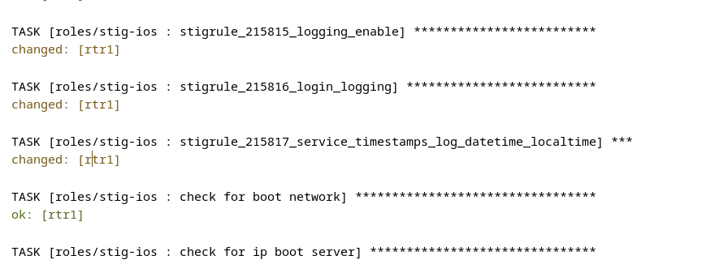

## Return to Menu
 - [Menu of Exercises](../README.md)

# Summary of steps
1. Run the Network-Compliance-Workflow
2. Review the check-mode output 
3. Use SSH to validate no change in routers 
3. Accept the approval node in the workflow
4. Review the run-mode output
5. Use SSH to Validate the changes were made in routers 
6. Optional, repeat for stig-ios

# Exercise-3 Network Compliance Checks ans Remediations

[Table of Contents](#table-of-contents)
  - [Step 1 - Run the Workflow](#step-1---run-the-workflow)
  - [Step 2 - Verify the completed workflow](#step-2---verify-the-completed-workflow)
  - [Step 3 - Run the Workflow with Stig](#step-3---run-the-workflow-with-stig)

## Objective
Launch a Workflow with a `self service survey` to select groups and roles to run compliance checks against. 

## Overview
In this exercise you will utilize roles, playbooks, job-templates, surveys, and create a workflow to manage compliance checks for a multi-vendor network. 

### Job-template Parameters:

Check mode will run the playbook to list the before state and the necessary remediation commands but not actually replace the configuration on the targeted devices.

[Network-Run-Compliance](../images/run.png)
Run mode will replace the needed configurations.

### Step 1 - Run the Workflow
Locate and Launch the Network-Compliance Workflow template. In the prompted survey, select all groups and all compliance roles except for `stig`. Stig-IOS will be run afterwards using only the Cisco group.

The initial workflow should run the Network-Compliance-Check node but pause at the approval node. 
1. Review the changed tasks in the output field as well as the `before`, `after`, `commands` that can be reviewed by selecting the json panels.

#### JSON Output
Notice in the output, "commands" indicate the configuration changes that need to be sent to the router or removed from the router. The state of replaced can add or remove configuration parameters. Since this is playbook was run in `checkmode` , the before and after `Diff` is identical. Thus, no changes are applied on the remote device.
~~~
{
  "commands": [
    "logging snmp-trap errors",
    "logging buffered 12000 notifications",
    "logging console critical",
    "logging facility local5",
    "logging monitor warnings",
    "no logging persistent size 1000000 filesize 8192 immediate",
    "logging trap errors",
    "logging userinfo",
    "logging host 1.1.1.2",
    "logging host 1.1.1.3",
    "no logging host 192.168.0.1"
  ],
  "before": {
    "persistent": {
      "filesize": 8192,
      "immediate": true,
      "size": 1000000
    },
    "hosts": [
      {
        "host": "192.168.0.1"
      }
    ]
  },
  "after": {
    "persistent": {
      "filesize": 8192,
      "immediate": true,
      "size": 1000000
    },
    "hosts": [
      {
        "host": "192.168.0.1"
      }
    ]
  },
  "changed": true,
  "invocation": {
    "module_args": {
      "config": {
        "buffered": {
          "severity": "notifications",
          "size": 12000,
          "discriminator": null,
          "filtered": null,
          "xml": null
        },
        "console": {
          "severity": "critical",
          "discriminator": null,
          "filtered": null,
          "xml": null
        },
        "facility": "local5",
        "hosts": [
          {
            "hostname": "1.1.1.2",
            "host": "1.1.1.2",
            "discriminator": null,
            "filtered": null,
            "sequence_num_session": null,
            "session_id": null,
            "stream": null,
            "transport": null,
            "vrf": null,
            "xml": null,
            "ipv6": null
          },
          {
            "hostname": "1.1.1.3",
            "host": "1.1.1.3",
            "discriminator": null,
            "filtered": null,
            "sequence_num_session": null,
            "session_id": null,
            "stream": null,
            "transport": null,
            "vrf": null,
            "xml": null,
            "ipv6": null
          }
        ],
        "monitor": {
          "severity": "warnings",
          "discriminator": null,
          "filtered": null,
          "xml": null
        },
        "snmp_trap": [
          "errors"
        ],
        "trap": "errors",
        "userinfo": true,
        "buginf": null,
        "cns_events": null,
        "count": null,
        "delimiter": null,
        "discriminator": null,
        "dmvpn": null,
        "esm": null,
        "exception": null,
        "filter": null,
        "history": null,
        "message_counter": null,
        "logging_on": null,
        "origin_id": null,
        "persistent": null,
        "policy_firewall": null,
        "queue_limit": null,
        "rate_limit": null,
        "reload": null,
        "server_arp": null,
        "source_interface": null
      },
      "state": "replaced",
      "running_config": null
    }
  },
  "_ansible_no_log": null
}
~~~

2. validate the Network-Compliance-Check job ran in check mode by accessing rtr1 
~~~
[student@ansible-1 network-demos-repo]$ ssh rtr1
Warning: Permanently added 'rtr1' (RSA) to the list of known hosts.

rtr1#sh run | s logging
logging persistent size 1000000 filesize 8192 immediate
logging host 192.168.0.1
~~~
Because of check mode, the two correct logging hosts were not added.
~~~
"logging host 1.1.1.2"
"logging host 1.1.1.3"
~~~

3. Return to the Network-Compliance-Workflow and approve the approval node.

* click on the change approval node "step"

* click the approve button below

### Step 2 - Verify the completed workflow

1. The completed workflow should look like the following

2. Review the Network-Run-Compliance job
Note, this time the before and after diff in the `json output` reflect making the commnd changes on the routers.

Json Output:
~~~
{
  "commands": [
    "logging snmp-trap errors",
    "logging buffered 12000 notifications",
    "logging console critical",
    "logging facility local5",
    "logging monitor warnings",
    "no logging persistent size 1000000 filesize 8192 immediate",
    "logging trap errors",
    "logging userinfo",
    "logging host 1.1.1.2",
    "logging host 1.1.1.3",
    "no logging host 192.168.0.1"
  ],
  "before": {
    "persistent": {
      "filesize": 8192,
      "immediate": true,
      "size": 1000000
    },
    "hosts": [
      {
        "host": "192.168.0.1"
      }
    ]
  },
  "after": {
    "userinfo": true,
    "buffered": {
      "severity": "notifications",
      "size": 12000
    },
    "console": {
      "severity": "critical"
    },
    "monitor": {
      "severity": "warnings"
    },
    "trap": "errors",
    "facility": "local5",
    "snmp_trap": [
      "alerts",
      "critical",
      "emergencies",
      "errors",
      "warnings"
    ],
    "hosts": [
      {
        "host": "1.1.1.2"
      },
      {
        "host": "1.1.1.3"
      }
    ]
  },
  "changed": true,
  "invocation": {
    "module_args": {
      "config": {
        "buffered": {
          "severity": "notifications",
          "size": 12000,
          "discriminator": null,
          "filtered": null,
          "xml": null
        },
        "console": {
          "severity": "critical",
          "discriminator": null,
          "filtered": null,
          "xml": null
        },
        "facility": "local5",
        "hosts": [
          {
            "hostname": "1.1.1.2",
            "host": "1.1.1.2",
            "discriminator": null,
            "filtered": null,
            "sequence_num_session": null,
            "session_id": null,
            "stream": null,
            "transport": null,
            "vrf": null,
            "xml": null,
            "ipv6": null
          },
          {
            "hostname": "1.1.1.3",
            "host": "1.1.1.3",
            "discriminator": null,
            "filtered": null,
            "sequence_num_session": null,
            "session_id": null,
            "stream": null,
            "transport": null,
            "vrf": null,
            "xml": null,
            "ipv6": null
          }
        ],
        "monitor": {
          "severity": "warnings",
          "discriminator": null,
          "filtered": null,
          "xml": null
        },
        "snmp_trap": [
          "errors"
        ],
        "trap": "errors",
        "userinfo": true,
        "buginf": null,
        "cns_events": null,
        "count": null,
        "delimiter": null,
        "discriminator": null,
        "dmvpn": null,
        "esm": null,
        "exception": null,
        "filter": null,
        "history": null,
        "message_counter": null,
        "logging_on": null,
        "origin_id": null,
        "persistent": null,
        "policy_firewall": null,
        "queue_limit": null,
        "rate_limit": null,
        "reload": null,
        "server_arp": null,
        "source_interface": null
      },
      "state": "replaced",
      "running_config": null
    }
  },
  "_ansible_no_log": null
}
~~~
3. Review the router configs. 
For example:
~~~
ssh rtr1

sh run | s logging
logging userinfo
logging buffered 12000 notifications
logging console critical
logging monitor warnings
logging trap errors
logging facility local5
logging snmp-trap emergencies
logging snmp-trap alerts
logging snmp-trap critical
logging snmp-trap errors
logging snmp-trap warnings
logging host 1.1.1.2
logging host 1.1.1.3
~~~
Similar commands can be ran on the Arista and Juniper routers.

### Step 3 - Run the Workflow with Stig 
Remove the following configuration to test the Stig-ios.

~~~
ssh rtr1
conf t
no service timestamps log datetime localtime
~~~

1. Rerun the Network-Compliance-Workflow template

2. Please note for this option to succeed, select the `Cisco` group and only `stig-ios` for the role in the survey.

### Step 4 - Verify the output
Take a look at the `stigrule_215817_service_timestamps_log_datetime_localtime` task in checkmode

Notice it wants to add the following command
~~~
 "commands": [
    "service timestamps log datetime localtime"
~~~
### Step 5 - Verify that rtr1 hasn't changed
Confirm that check mode did not make the config change for the above command.
~~~
ssh rtr1
rtr1#sh run | s service
service timestamps debug datetime msec
no service timestamps log
service password-encryption
~~~
### Step 6 - Approve and Run mode
Return to the Network-Compliance Workflow and approve the approval node and wait for the playbook to complete in run mode.

### Step 7 - Verify that rtr1 has changed
~~~
ssh rtr1
rtr1#sh run | s service
service timestamps debug datetime msec
service timestamps log datetime localtime
service password-encryption
~~~

Congratulations your stig check completed and your devices are compliant!!!! or at least for now ;-)

# Key Takeaways
* Compliance checks are easy to create with network resource modules and the state of replaced
* Check mode allows you to run a playbook with output but not apply the changes to the device
* Run mode applies the changes to remote devices
* Approval Nodes pause a workflow to allow for changes or troubleshooting prior to applying changes to production

## Return to Exercise Menu
 - [Menu of Exercises](../README.md)

