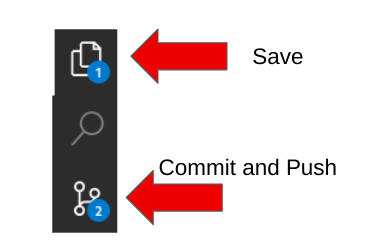

## Return to Menu
 - [Menu of Exercises](../README.md)

# Summary of steps
1. Run the Network-Troubleshooting job-template and fix rtr2
2. Run the Network-Validated-Persist job-template
3. Review the /home/student/scoped_configuration_management/host_vars 
4. Modify host_vars/rtr1.yml to add the network 192.168.3.3 mask 255.255.255.255
5. Modify host_vars/rtr2.yml to add the network 192.168.4.4/32 
6. Commit and Push change to Gitea
7. Run the Network-Validated-Deploy job-template
8. Validate changed in output
9. SSH to rtr1 to add a mistaken configuration
10. Run the Network-Validated-Detect job-template
11. Verify Configuration Drift
12. Run the Network-Validated-Remediate job-template
13. Verify Changed removed the mistaken network prefix.


# Troubleshooting basic OSPF with Ansible
[Table of Contents](#table-of-contents)
- [Troubleshooting](#troubleshooting)

# Scoped Configuration Management with Validated Content (BGP)

[Table of Contents](#table-of-contents)
- [Step 1 - Persist](#step-1---persist)
- [Step 2 - Deploy](#step-2---deploy)
- [Step 3 - Detect](#step-3---detect)
- [Step 4 - Remediate](#step-4---remediate)


## Objective
Launch `job-templates` that use playbooks developed with `validated content` for networks. The main use case is to establish a single `source of truth` for your network environment. The validated content will allow you to gather facts from brownfield devices to simplify creating a single source of truth mapped to the `inventory host_vars`. With a SSOT in mind, we can easily manage `configuration drift` and accept or remediate changes using intelligent roles from the validated content for networks collection.

## Overview
The Ansible validated content for networks `network.base` focuses on abstract platform-agnostic network automation and enhances the experience of resource module consumption by providing production-ready content. This network base content acts as the core to the other network validated content, such as `network.bgp` and `network.interfaces`.  

## Troubleshooting
In this section we will use Ansible to troubleshoot a small OSPF issue before we configure BGP using Validated Content.

1. Run the Network-Troubleshooting job-template and evaluate the output.
rtr4 is connected to rtr2 with OSPF. At this point, rtr4 is unable to ping rtr2's loopback 0 ip address.

#### Example Output
~~~
PLAY [Validate the Environment for a New Router] *******************************

TASK [Check Route Table for rtr2] **********************************************
ok: [rtr4]

TASK [Print Event Info] ********************************************************
ok: [rtr4] => {
    "msg": [
        "192.168.2.2",
        [
            "PING 192.168.2.2 (192.168.2.2) 72(100) bytes of data.",
            "",
            "--- 192.168.2.2 ping statistics ---",
            "5 packets transmitted, 0 received, 100% packet loss, time 40ms"
        ]
    ]
}

TASK [Assert the ping can reach the loopback at 192.168.2.2] *******************************
fatal: [rtr4]: FAILED! => {
    "assertion": "'100% packet loss' not in arista_ping['stdout'][0]",
    "changed": false,
    "evaluated_to": false,
    "msg": "The ping to 192.168.2.2 failed"
}

TASK [Check Route Table for rtr4] **********************************************
ok: [rtr4]

TASK [Print Event Info] ********************************************************
ok: [rtr4] => {
    "msg": [
        "192.168.2.2",
        [
            "VRF: default",
            "Codes: C - connected, S - static, K - kernel, ",
            "       O - OSPF, IA - OSPF inter area, E1 - OSPF external type 1,",
            "       E2 - OSPF external type 2, N1 - OSPF NSSA external type 1,",
            "       N2 - OSPF NSSA external type2, B - Other BGP Routes,",
            "       B I - iBGP, B E - eBGP, R - RIP, I L1 - IS-IS level 1,",
            "       I L2 - IS-IS level 2, O3 - OSPFv3, A B - BGP Aggregate,",
            "       A O - OSPF Summary, NG - Nexthop Group Static Route,",
            "       V - VXLAN Control Service, M - Martian,",
            "       DH - DHCP client installed default route,",
            "       DP - Dynamic Policy Route, L - VRF Leaked,",
            "       G  - gRIBI, RC - Route Cache Route",
            "",
            "Gateway of last resort:",
            " DH       0.0.0.0/0 [254/0] via 172.18.0.1, Ethernet1"
        ]
    ]
}

TASK [Assert 192.168.2.2 is advertised by OSPF] *********************
fatal: [rtr4]: FAILED! => {
    "assertion": "'Gateway of last resort' not in arista_route['stdout'][0]",
    "changed": false,
    "evaluated_to": false,
    "msg": "The 192.168.2.2 route is blackholed to the default gateway!"
}

TASK [Check Route Config for rtr2] *********************************************
ok: [rtr4]
ok: [rtr2]

TASK [Print config] ************************************************************
ok: [rtr4] => {
    "msg": [
        [
            "interface Tunnel0",
            "   ip ospf network point-to-point",
            "   ip ospf area 0.0.0.0",
            "router ospf 1",
            "   router-id 192.168.4.4",
            "   redistribute connected",
            "   max-lsa 12000"
        ]
    ]
}
ok: [rtr2] => {
    "msg": [
        [
            "interface Tunnel0",
            "   ip ospf network point-to-point",
            "   ip ospf area 0.0.0.0",
            "router bgp 65001",
            "   redistribute ospf match external",
            "router ospf 1",
            "   router-id 192.168.2.2",
            "   redistribute bgp",
            "   max-lsa 12000"
        ]
    ]
}
 
~~~

In the above output we can glean that rtr2 needs `redistribute connected` added to the OSPF configuration.

2. SSH to rtr2 and fix OSPF
~~~
ssh rtr2
conf t
router ospf 1
redistribute connected
end
~~~

3. Rerun the Network-Troubleshooting job-template and evaluate the output.

#### Example Output
~~~
PLAY [Validate the Environment for a New Router] *******************************

TASK [Check Route Table for rtr2] **********************************************
ok: [rtr4]

TASK [Print Event Info] ********************************************************
ok: [rtr4] => {
    "msg": [
        "192.168.2.2",
        [
            "PING 192.168.2.2 (192.168.2.2) 72(100) bytes of data.",
            "80 bytes from 192.168.2.2: icmp_seq=1 ttl=64 time=4.07 ms",
            "80 bytes from 192.168.2.2: icmp_seq=2 ttl=64 time=3.95 ms",
            "80 bytes from 192.168.2.2: icmp_seq=3 ttl=64 time=3.95 ms",
            "80 bytes from 192.168.2.2: icmp_seq=4 ttl=64 time=3.95 ms",
            "80 bytes from 192.168.2.2: icmp_seq=5 ttl=64 time=3.95 ms",
            "",
            "--- 192.168.2.2 ping statistics ---",
            "5 packets transmitted, 5 received, 0% packet loss, time 16ms",
            "rtt min/avg/max/mdev = 3.954/3.979/4.075/0.073 ms, ipg/ewma 4.029/4.025 ms"
        ]
    ]
}

TASK [Assert the ping can reach the loopback at 192.168.2.2] *******************
ok: [rtr4] => {
    "changed": false,
    "msg": "The ping  to 192.168.2.2 passed"
}

TASK [Check Route Config for rtr2] *********************************************
ok: [rtr4]
ok: [rtr2]

TASK [Print config] ************************************************************
ok: [rtr2] => {
    "msg": [
        [
            "interface Tunnel0",
            "   ip ospf network point-to-point",
            "   ip ospf area 0.0.0.0",
            "router bgp 65001",
            "   redistribute ospf match external",
            "router ospf 1",
            "   router-id 192.168.2.2",
            "   redistribute bgp",
            "   redistribute connected",
            "   max-lsa 12000"
        ]
    ]
}
ok: [rtr4] => {
    "msg": [
        [
            "interface Tunnel0",
            "   ip ospf network point-to-point",
            "   ip ospf area 0.0.0.0",
            "router ospf 1",
            "   router-id 192.168.4.4",
            "   redistribute connected",
            "   max-lsa 12000"
        ]
    ]
}
~~~
This time we observe a successful ping to rtr2's loop back zero and a proper OSPF configuration.

#### Main points
1. Examine in the VSCode file explorer or cat from the terminal ~~~
~~~ 
4-multi_vendor_validated_content_bgp/troubleshoot.yml
~~~
The simple troubleshooting playbook used in this exercise incorporates the following:

- assert: used for state checks by determining that given expressions are true with an optional custom message
- block: create logical groups of tasks. Blocks also offer ways to handle task errors, similar to exception handling in many programming languages
- rescue: specify tasks to run when an earlier task in a block fails. 
- always: run no matter what the task status of the previous block is.


## Validated Content
In this section we will use validated content to automate `brownfield` routers and add and change configurations in BGP.

### Step 1 - Persist
The resource_manager role uses the `persist action` to get the facts for a given resource and store it as inventory host_vars. 

1. Review a job-template named `Network-Validated-Persist`.

2. Review the `persist.yml` playbook located `4-multi_vendor_validated_content_bgp/persist.yml`
- Notice how the resource modules are listed in the `vars/resource` for the play. In turn, the resource_manager role will render a hostvars/.yml file for each resource entry. For this exercise in particular, we are using the ansible.scm collection to customize saving the files to the main branch of the git repo. Alternatively, the scm parameter for the resource_manager role could checkout and push files to a new branch each time.    

- Notice that this playbook includes the role resource_manager. There is no local roles folder in this exercise. The network.base collection is installed in our execution environment container. How does ansible locate this resource_manager role that is included in a collection?
```
ansible.builtin.include_role:
        name: resource_manager
```
In the root of the project directory there is an ansible.cfg file. In this file we created a roles_path to the network.base validated collection from the EE.
```
roles_path = /usr/share/ansible/collections/ansible_collections/network/base/roles/
```

3. Launch the `Network-Validated-Persist` job template and review the output.

4. From the VSCode terminal:
~~~
git pull
~~~
5. Verify the host_vars entries for each of the four routers in 4-multi_vendor_validated_content_bgp/host_vars/` of your student-repo project.
* Verify from VSCode
~~~
$ ls  4-multi_vendor_validated_content_bgp/host_vars/
rtr1  rtr2  rtr3  rtr4
~~~

### Step 2 - Deploy
The network.bgp.run role uses the Deploy operations to apply changes to the listed resources. The `deploy` works well for additions to the device's configuration because it uses the state of `merged`. The state of merged is idempotent, thus it will not overwrite any existing configurations.

1. Add a new BGP network prefix "192.168.4.4/32 entry to the "4-multi_vendor_validated_content_bgp/hostvars/rtr2/bgp_address_family.yaml" configuration file. These entries will advertise the Loopback0 from rtr4 in BGP.

#### From VSCode 
1.   Open 4-multi_vendor_validated_content_bgp/hostvars/rtr2/bgp_address_family.yaml
2. Be careful with indentation.

- Example for rtr2
~~~
bgp_address_family:
    address_family:
    -   afi: ipv4
        neighbor:
        -   activate: true
            peer: 10.200.200.1
        network:
        -   address: 10.101.101.0/24
        -   address: 10.200.200.0/24
        -   address: 172.18.0.0/16
        -   address: 192.168.2.2/32
        -   address: 192.168.4.4/32  #Add here
    as_number: '65001'
~~~

2. Complete the git steps for your change. You must save, commit the file in the VSCode IDE and "sync" push to gitea after fixing the file.


or update from the terminal
~~~
git add --all
git commit -m "deploy"
git push
~~~

3. The playbook `deploy.yml` in `4-multi_vendor_validated_content_bgp/hostvars/rtr2/bgp_address_family.yaml/` 
- Note the similarity to the persist.yml but this time the operation is "deploy". 

4. Launch the Network-Validated-Deploy job-template. After the deploy.yml completes, ensure that the playbook "changed" adds the network prefix "192.168.4.4"


- From the stdout filter input "changed" and locate rtr2
 

- Click on changed to take a look at the json output. Locate the 192.168.4.4/32 in the `after` output from the module.
 
    
### Step 3 - Detect
The resource_manager role and other related roles such ad network.bgp.run use the detect operation to manage configuration drift. For instance if someone were to add an entry from the CLI that differs from the SSOT `host_vars` then the validated role would fail and call out the Diff.

1. Access rtr1 from the VSCode terminal and ssh

~~~
ssh rtr1
~~~

2. Use the CLI to add a network prefix to rtr1 for rtr3's loobback0 that is a mistake. Sometimes OOB changes made from the CLI are pron to mistakes. Ooops you just fat fingered it....

~~~
config t
router bgp 65000
address-family ipv4 
network 192.168.1.3 
end
~~~

5. Launch the `Network-Validated-Detect` and note the configuration drift for rtr1.

The rtr1's running config is the before diff in red. The 192.168.1.3 entry is drift from our host_vars (SSOT) because it was configured OOB and isn't present in the host_vars.

 

### Step 4 - Remediate
The resource_manager role and other related roles such ad network.bgp.run use the remediation action to overwrite (add or remove) configuration that are not reconciled with the host_vars yaml files. In this demo the host_vars files are our single source of truth (SSOT).

1. Launch the `Network-Validated-Remediate` job-template
Ensure that the playbook removes the "errored" 192.168.1.3 network prefix mistake to rtr1 and "changes" adds the network prefix "192.168.3.3 to rtr1. 

2. Review the changed entry for rtr1 to validate the 192.168.1.3 entry was successfully removed.


Congratulations the Validated network.base collection has reconciled your routers with using the `host_vars` as source of truth! 

# Key Takeaways
* Automated Testing is useful for identifying and resolving issues.
* Validated Content provides intelligent `roles` with out of the box configurations
* Brownfield configurations can be gathered and pushed to a Git repo as a source of truth
* Specialty validated content make adds, changes, drift and rollbacks very easy.

## Return to Exercise Menu
 - [Menu of Exercises](../README.md)

