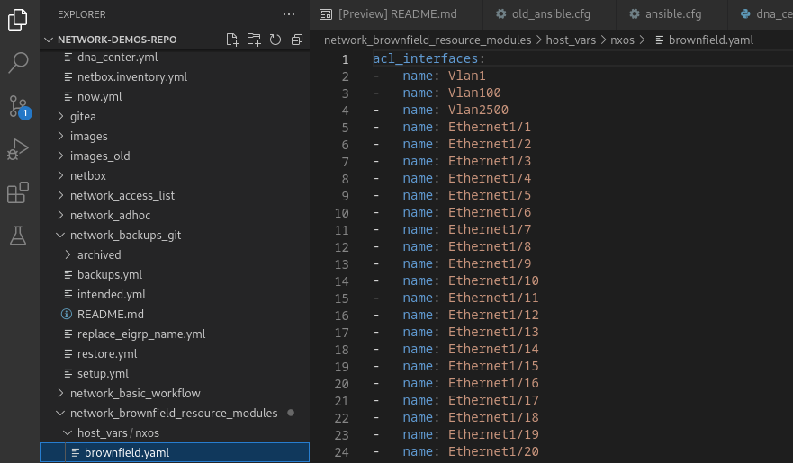
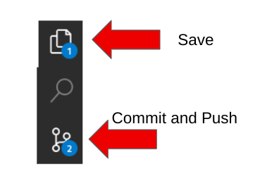

## Return to Menu
 - [Menu of Exercises](../README.md)

## Exercise-5 Brownfield Switches Resource Modules
This Exercise requires access to the NXOS always on router in Cisco Devnet

Host	              	
sbx-nxos-mgmt.cisco.com	
Username: admin
Password: Admin_1234!
Port: 22
NetConf: 830
NXAPI: 443

[Table of Contents](#table-of-contents)
- [Step 1 - Run the Job-template network_brownfield_resource_modules](#step-1---run-the-job--template-network-brownfield-resource-modules)
- [Step 2 - Inspect your new host_vars](#step-2---inspect-your-new-host_vars)
- [Step 3 - Make a change](#step-3---make-a-change)
- [Step 4 - Review the Diff](#step-4---review-the-diff)
- [Step 5 - Run the network_brownfield_deploy Job-template ](#step-5---run-the-network-brownfield_deploy-job-template)
- [Step 6 - Check Ports ](#step-6---check-ports)

## Steps

### Step 1 - Run the Job-template Network-Brownfield-Resource-Modules 
- In this step launch the job template `Network-Brownfield-Resource-Modules`
* This will run the brownfield.yml playbook to collect configurations as a YAML file.

### Step 2 - Inspect your new host_vars
From the VSCode terminal 
~~~
git pull
~~~
At this point you should observe a host_vars/brownfield.yml file in `5-brownfield_switches_resource_modules/`

### Step 3 - Make a change 
1. locate Ethernet1/1 add/change the description to `workshop`
- note, that the N9k is shared publicly, consequently, the current config for E1/1 might look different.
- Also note we are all changing the same interface, hence it will be changing several times.
~~~
interfaces:
-   name: Vlan1
-   enabled: true
    name: Vlan100
-   enabled: true
    name: Vlan2500
-   description: change_here
    name: Ethernet1/1
~~~
2.  Complete the git steps for your change. You must save, commit the file in the VSCode IDE and "sync" push to gitea after fixing the file.

or update from the terminal
~~~
git add --all
git commit -m "deploy"
git push
~~~
### Step 4 - Review the Diff
Run the Job-template `Network-brownfield-diff` Job template for the diff.yml playbook to identify the difference between the SSOT `host_vars` versus the running configuration on the switch. Note the change you made to E1/1... 
* Notice the job template is running in `check mode` as to not apply any changes.

- Click into the changed output and json link to see the builtin diff:
~~~
{
  "changed": true,
  "commands": [
    "interface Ethernet1/1",
    "description workshop"
  ],
  "before": [
    {
      "enabled": true,
      "name": "Vlan1"
    },
    {
      "description": "cisco profes",
      "name": "Vlan60"
    },
    {
      "description": "cisco profes",
      "name": "Vlan61"
~~~
truncated

### Step 5 - Run the Network_Brownfield_Deploy Job-template 
- In this step launch the job template Network_Brownfield_Deploy Job-template
* This will run the deploy.yml playbook to add the change in `run mode`.

### Step 6 - Check Ports 
* In this exercise we identify interfaces/l2_interfaces that match specific configurations. This demo uses network resource module facts and selectattr filters.

#### Main Points
Examine the `5-brownfield_switches_resource_modules/checkports.yml playbook

* gather_network_resources: Possible values for this argument include all and the resources like interfaces, vlans etc. Can specify a list of values to include a larger subset. In this exercise we use  ‘interfaces’,and ‘l2_interfaces’.
* selectattr: filters a sequence of objects based on attributes of the objects in the list.
* map: applies a filter on a sequence of objects or to look up an attribute. This is useful when you have lists of objects but you are interested in only a certain value.

1. ssh to the Cisco NXOS always on sandbox.

~~~
sbx-nxos-mgmt.cisco.com	
Username: admin
Password: Admin_1234!

ssh admin:'Admin_1234!'@sbx-nxos-mgmt.cisco.com	
~~~
You will still need to type the password.

2. Paste in this configuration

~~~
conf t
feature port-security
vlan 199
name vl_199
vlan 101
name vl_101

interface ethernet 1/6 , ethernet 1/8 , ethernet 1/12 , ethernet 1/14 , ethernet 1/24
no sw
sw
sw mode trunk
sw trunk native vlan 199
description trunk port

interface ethernet 1/7, ethernet 1/9, ethernet 1/11 , ethernet 1/15 , ethernet 1/25
no sw
sw
sw mode access
sw access vl 101
description access port
sw port-security violation restrict 
sw port-security mac-address sticky
end
~~~

3. Launch the "Network-Brownfield-Config-Ports" job template 
Observe how the ansible_facts with network resource modules can gather the configurations and selectattr filters can match on specific keys. 

#### Output
This playbook will provide the following output

* A list of interfaces for descriptions that match 'access port'
* A list of interfaces for descriptions that match 'trunk port'
* A list of interfaces that have trunk and native vlan 199 configured
* A list of interfaces that have access vlan 101 configured
* A list of interfaces with port security configured

~~~
PLAY [Check Ports] *************************************************************

TASK [Gather interfaces resources] *********************************************
ok: [nxos]

TASK [Set Description Filter] **************************************************
ok: [nxos]

TASK [list_descriptions] *******************************************************
ok: [nxos] => {
    "msg": [
        "host_name: nxos",
        "interfaces with the description 'trunk port':['Ethernet1/6', 'Ethernet1/8', 'Ethernet1/12', 'Ethernet1/14', 'Ethernet1/24']",
        "interfaces with the description 'access port':['Ethernet1/7', 'Ethernet1/9', 'Ethernet1/11', 'Ethernet1/15', 'Ethernet1/25']"
    ]
}

TASK [Set Trunk Filter] ********************************************************
ok: [nxos]

TASK [List the trunk ports based on native vlan match] *************************
ok: [nxos] => {
    "msg": [
        "host_name: nxos",
        "trunk mode interfaces with native vlan 199: ['Ethernet1/6', 'Ethernet1/8', 'Ethernet1/12', 'Ethernet1/14', 'Ethernet1/24']"
    ]
}

TASK [Set Access Vlan Filter] **************************************************
ok: [nxos]

TASK [List the Access ports based on match] ************************************
ok: [nxos] => {
    "msg": [
        "host_name: nxos",
        "access mode interfaces with native vlan 101: ['Ethernet1/7', 'Ethernet1/9', 'Ethernet1/11', 'Ethernet1/15', 'Ethernet1/25']"
    ]
}

TASK [Find Port Security for Access Ports] *************************************
ok: [nxos] => (item=Ethernet1/1)
ok: [nxos] => (item=Ethernet1/2)
ok: [nxos] => (item=Ethernet1/3)
ok: [nxos] => (item=Ethernet1/4)
ok: [nxos] => (item=Ethernet1/5)
ok: [nxos] => (item=Ethernet1/7)
ok: [nxos] => (item=Ethernet1/9)
ok: [nxos] => (item=Ethernet1/11)
ok: [nxos] => (item=Ethernet1/15)
ok: [nxos] => (item=Ethernet1/25)

TASK [Set Access Vlan Filter] **************************************************
ok: [nxos]

TASK [print access ports with Port Security enabled] ***************************
ok: [nxos] => {
    "msg": [
        "Interfaces with Port Security Configured",
        [
            "Ethernet1/7",
            "Ethernet1/9",
            "Ethernet1/11",
            "Ethernet1/15",
            "Ethernet1/25"
        ]
    ]
}
~~~
# Key Takeaways
* Ansible makes it easy to gather and save configs a YAML files in host_vars.
* Ansible makes it easy to make changes on brownfield devices.
* It's easy to locate configurations on devices by using network_resource_modules and filters for selecattr and map.

## Return to Exercise Menu
 - [Menu of Exercises](../README.md)

 
 