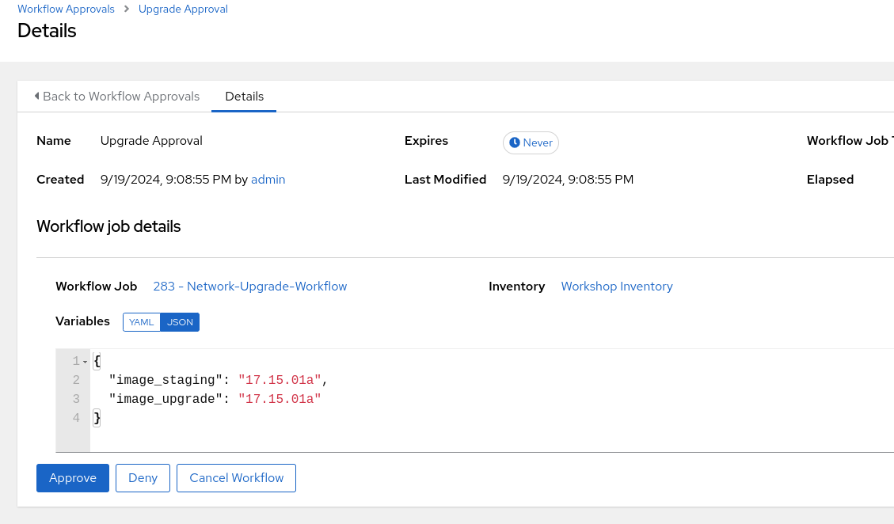

## Return to Menu
 - [Menu of Exercises](../README.md)

# Summary of steps
1. Install gdown
2. Download the c8000v image to `6-network_upgrade_as_code` and push to gitea
3. Move the c8000v image out of the repo when done. (Important!!!)
4. Run the Network-Upgrade-Workflow template and choose image and approve the upgrade
6. Review the Network-Upgrade-Upgrade job-template 

# Exercise-6 Network Upgrade as Code

[Table of Contents](#table-of-contents)
- [Step 1 - Install gdown](#step-1---install-gdown)
- [Step 2 - Download Images](#step-2---download-images)
- [Step 3 - Run the Network-Upgrade-Workflow](#step-3---run-the-network-upgrade-workflow)
- [Step 4 - Move Image](#step-4---move-image)
- [Step 5 - Return to the Workflow](#step-5---return-to-the-workflow)
- [Step 6 - Review the Network-Upgrade-Upgrade Job-Template output](#step-6---review-the-network-upgrade-upgrade-job-template-output)

## Objective
To stage firmware images and upgrade network devices with Ansible. Please note it takes several minutes to both stage files and upgrade.   

## Overview
Software Image Management (SWIM) is a repeatable framework where engineers can produce repeatable, safe outcomes for efficient device software upgrades. This results in a faster response to vulnerability management, more predictable maintenance schedules, and hours of an engineer’s life saved in the middle of the night.

Ansible can scp firmware images to network devices. The workflow includes an approval node to control when an upgrade will be activated based on change control. 

## Main Points
In this exercise you will use the following:
- ansible.netcommon.netput module to push files with scp
- cisco.ios.ios_command module with prompts to interact with the CLI upgrade process

### Step 1 - Install gdown
Install gdown
~~~
pip install gdown
~~~

### Step 2 - Download Images
From the folder `6-network_upgrade_as_code/`

1. gdown
~~~
gdown https://drive.google.com/uc?id=1cPPO1mxIZf4weIi497r3ffGC5g0_S58i
~~~

2. Push to gitea repo
This way the image files will be available for Ansible. Normally we would store these image files on a server instead of the git repo.
Complete the git steps for your change. You must save, commit the file in the VSCode IDE and "sync" push to gitea after fixing the file.

or update from the terminal
~~~
git add --all
git commit -m "deploy"
git push
~~~
### Step 3 - Run the Network-Upgrade-Workflow

This will take a few minutes due to the file size.
1. Run the Network-Upgrade-Workflow template to stage the image.
Select the following when prompted for the staging and upgrade file 
~~~
17.15.01a
~~~

2. Review the staging output and `6-network_upgrade_as_code/staging.yml` playbook.

output:
~~~
PLAY [Playbook to stage/scp .bin to router bootflash] **************************

TASK [enable scp] **************************************************************
changed: [rtr1]

TASK [check for old files and remove them if found] ****************************
ok: [rtr1]

TASK [Display install_remove output and result] ********************************
ok: [rtr1] => {
    "msg": "Old files removed successfully."
}

TASK [check if image already exist in bootflash] *******************************
ok: [rtr1]

TASK [Push new image from project to bootflash] ********************************
changed: [rtr1]

TASK [Set SHA512 Checksum for 17.15.01a] ***************************************
ok: [rtr1]

TASK [Verify SHA512 Hash of Image File] ****************************************
ok: [rtr1]

TASK [Set SHA512_hash_verification to pass/fail] *******************************
ok: [rtr1]

PLAY RECAP *********************************************************************
rtr1                       : ok=8    changed=2    unreachable=0    failed=0    skipped=1    rescued=0    ignored=0   
~~~

### Step 4 - Move Image
 Move the image file out of the network-demos-repo to the home directory
#### It's important to move the image file otherwise, the repo in Gitea could fail on future tasks. 

 mv the file
~~~
mv c8000v-universalk9.17.15.01a.SPA.bin /home/student
~~~
2. Push to gitea repo
This way the image files will no longer be in the repo.
Complete the git steps for your change. You must save, commit the file in the VSCode IDE and "sync" push to gitea after fixing the file.

or update from the terminal
~~~
git add --all
git commit -m "deploy"
git push
~~~
### Step 5 - Return to the Workflow
At this time the Network-Upgrade-Workflow job is waiting for someone to approve the upgrade.

##### Remember to return to the AAP JOB for the Workflow and accept the approval node

### Step 6 - Review the Network-Upgrade-Upgrade Job-Template output
~~~
PLAY [Playbook to upgrade .bin to router bootflash] ****************************

TASK [change boot system to load new image next reload] ************************
changed: [rtr1]

TASK [check if correct image still exist in bootflash, if not FAIL the playbook] ***
ok: [rtr1]

TASK [install new version with activate and commit] ****************************
ok: [rtr1]

TASK [debug] *******************************************************************
ok: [rtr1] => {
    "install_activate_output.stdout_lines": [
        [
            "install_add_activate_commit: START Fri Sep 20 01:13:59 UTC 2024",
            "install_add: START Fri Sep 20 01:13:59 UTC 2024",
            "install_add: Adding IMG",
            "--- Starting initial file syncing ---",
            "Copying bootflash:c8000v-universalk9.17.15.01a.SPA.bin from  R0 to  R0",
            "Info: Finished copying to the selected ",
            "Finished initial file syncing",
            "",
            "--- Starting Add ---",
            "Performing Add on all members",
            "Checking status of Add on [R0]",
            "Add: Passed on [R0]",
            "Image added. Version: 17.15.01a.0.193",
            "",
            "Finished Add",
            "",
            "install_activate: START Fri Sep 20 01:14:21 UTC 2024",
            "install_activate: Activating IMG",
            "Following packages shall be activated:",
            "/bootflash/c8000v-rpboot.17.15.01a.SPA.pkg",
            "/bootflash/c8000v-mono-universalk9.17.15.01a.SPA.pkg",
            "/bootflash/c8000v-firmware_nim_async.17.15.01a.SPA.pkg",
            "/bootflash/c8000v-firmware_nim_xdsl.17.15.01a.SPA.pkg",
            "/bootflash/c8000v-firmware_nim_ge.17.15.01a.SPA.pkg",
            "/bootflash/c8000v-firmware_nim_cwan.17.15.01a.SPA.pkg",
            "/bootflash/c8000v-firmware_ngwic_t1e1.17.15.01a.SPA.pkg",
            "/bootflash/c8000v-firmware_dreamliner.17.15.01a.SPA.pkg",
            "/bootflash/c8000v-firmware_nim_shdsl.17.15.01a.SPA.pkg",
            "",
            "This operation may require a reload of the system. Do you want to proceed? [y/n]y",
            "",
            "",
            "--- Starting Activate ---",
            "Performing Activate on all members",
            " [1] Activate package(s) on  R0",
            " [1] Finished Activate on  R0",
            "Checking status of Activate on [R0]",
            "Activate: Passed on [R0]",
            "Finished Activate",
            "",
            "--- Starting Commit ---",
            "Performing Commit on all members",
            " [1] Commit package(s) on  R0",
            " [1] Finished Commit on  R0",
            "Checking status of Commit on [R0]",
            "Commit: Passed on [R0]",
            "Finished Commit operation",
            "",
            "SUCCESS: install_add_activate_commit Fri Sep 20 01:18:49 UTC 2024"
        ]
    ]
}

TASK [waiting for reboot] ******************************************************
ok: [rtr1]

PLAY [Playbook to confirm bootloader after reload] *****************************

TASK [show bootloader config] **************************************************
ok: [rtr1]

TASK [assert bootloader config changed] ****************************************
ok: [rtr1] => {
    "changed": false,
    "msg": "17.15.01a is present"
}

PLAY RECAP *********************************************************************
rtr1                       : ok=7    changed=1    unreachable=0    failed=0    skipped=0    rescued=0    ignored=0   
~~~
~~~
ssh rtr1
sh ver
Cisco IOS XE Software, Version 17.15.01a
~~~
### Step 7 - Review the post upgrade validation
Also take a look at the 6-network_upgrade_as_code/validate_network.yml playbook.

###output
~~~
PLAY [Validate the Environment] ************************************************

TASK [Check Interface State for rtr1] ******************************************
ok: [rtr1]

TASK [Print Event Info] ********************************************************
ok: [rtr1] => {
    "int_state.stdout_lines": [
        "Interface              IP-Address      OK? Method Status                Protocol",
        "GigabitEthernet1       172.16.209.103  YES DHCP   up                    up      ",
        "Loopback0              192.168.1.1     YES NVRAM  up                    up      ",
        "Tunnel0                10.100.100.1    YES NVRAM  up                    up      ",
        "Tunnel1                10.200.200.1    YES NVRAM  up                    up      ",
        "VirtualPortGroup0      192.168.35.101  YES NVRAM  up                    up"
    ]
}

TASK [Assert that rtr1 interfaces are UP] **************************************
ok: [rtr1] => {
    "changed": false,
    "msg": "rtr1 interfaces are up"
}

TASK [Show IP OSPF Neighbor] ***************************************************
ok: [rtr1]

TASK [Assert that OSPF neighbor exists] ****************************************
ok: [rtr1] => {
    "changed": false,
    "msg": "The OSPF Neighbor to rtr3 at 172.16.212.11 is Full"
}

TASK [Show IP BGP Neighbor] ****************************************************
ok: [rtr1]

TASK [Assert that BGP neighbor exists] *****************************************
ok: [rtr1] => {
    "changed": false,
    "msg": "BGP Neighbor to rtr2 at 172.18.140.210 is Established"
}

TASK [Ping neighbors] **********************************************************
ok: [rtr1] => (item=172.16.212.11)
ok: [rtr1] => (item=172.18.140.210)

TASK [Print Ping Output] *******************************************************
ok: [rtr1] => {
    "msg": {
        "changed": false,
        "msg": "All items completed",
        "results": [
            {
                "ansible_loop_var": "ping_item",
                "changed": false,
                "commands": "ping ip 172.16.212.11",
                "failed": false,
                "invocation": {
                    "module_args": {
                        "afi": "ip",
                        "count": null,
                        "dest": "172.16.212.11",
                        "df_bit": false,
                        "egress": null,
                        "ingress": null,
                        "size": null,
                        "source": null,
                        "state": "present",
                        "timeout": null,
                        "vrf": null
                    }
                },
                "packet_loss": "0%",
                "packets_rx": 5,
                "packets_tx": 5,
                "ping_item": "172.16.212.11",
                "rtt": {
                    "avg": 1,
                    "max": 1,
                    "min": 1
                }
            },
            {
                "ansible_loop_var": "ping_item",
                "changed": false,
                "commands": "ping ip 172.18.140.210",
                "failed": false,
                "invocation": {
                    "module_args": {
                        "afi": "ip",
                        "count": null,
                        "dest": "172.18.140.210",
                        "df_bit": false,
                        "egress": null,
                        "ingress": null,
                        "size": null,
                        "source": null,
                        "state": "present",
                        "timeout": null,
                        "vrf": null
                    }
                },
                "packet_loss": "0%",
                "packets_rx": 5,
                "packets_tx": 5,
                "ping_item": "172.18.140.210",
                "rtt": {
                    "avg": 1,
                    "max": 3,
                    "min": 1
                }
            }
        ],
        "skipped": false
    }
}

PLAY RECAP *********************************************************************
rtr1                       : ok=9    changed=0    unreachable=0    failed=0    skipped=0    rescued=0    ignored=0   
~~~

# Key Takeaways
* Ansible can scp firmware images to network devices. `netcommon.net_put` 
* Approval nodes can control when an upgrade will be activated based on change control. 
* Assertions to validate a functioning pre and post upgrade device

## Return to Exercise Menu
 - [Menu of Exercises](../README.md)