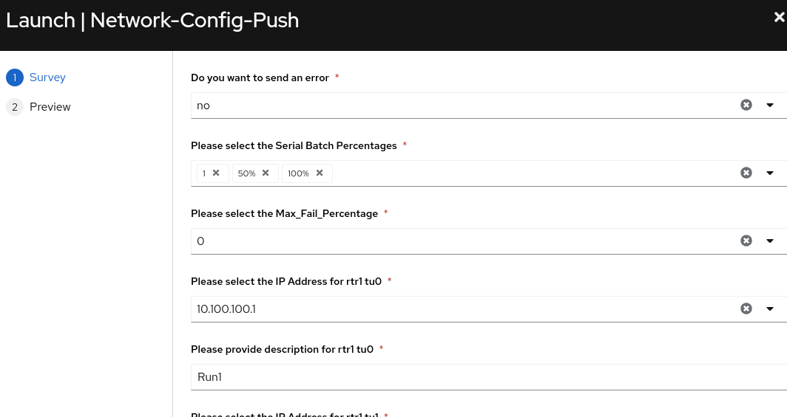
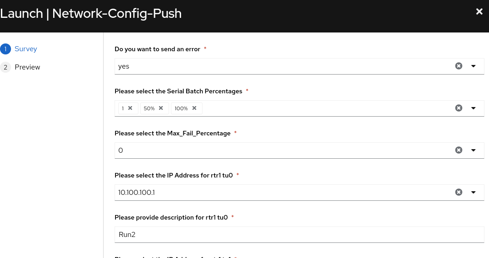
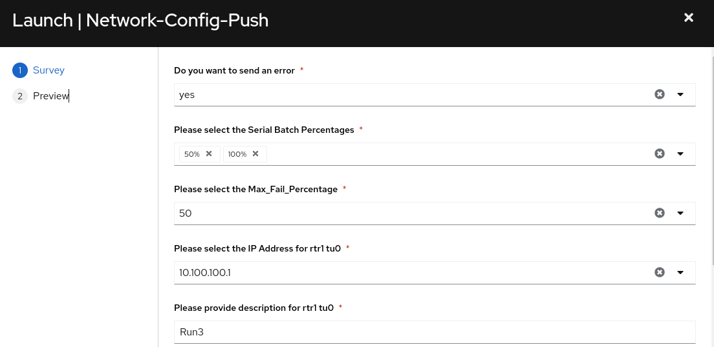

## Return to Menu
 - [Menu of Exercises](../README.md)

This needs to be completed
# Summary of steps
1. Review `host_vars/rtr1/bgp_address_family.yaml` and  `host_vars/rtr1/bgp_address_family.yaml` and `host_vars/rtr1/interfaces.yaml`
2. Uncomment the appropriate configurations to make a change.
3. Run the Network-Config-Push-Workflow
4. Review outputs
5. Optional run [text](../scoped_configuration_management) persist to discover YAML configs

# Exercise-7 Tuning for Scale

[Table of Contents](#table-of-contents)
- [Step 1 - Network-Config-Push Job-Template with No Error](#step-1---network-config-push-job-template-with-no-error)
- [Step 2 - Network-Config-Push Job-Template with an Error](#step-2---network-config-push-job-template-with-an-error)
- [Step 3 - Network-Config-Push Job-Template with an Error](#step-3---network-config-push-job-template-with-an-error)

## Objective
To demonstrate how to push a configuration to a Cisco router that is joining an existing tunnel based topology. The YAML host_var configuration files are provide for you. See step 5 to learn how to collect the configurations from a brownfield device.

## Overview
In this demo we will use resource modules , jinja2 templates and YAML configuration files to automate introducing a Cisco router into an existing multi-vendor topology. The playbook orchestration is managed with self service surveys and an Ansible AAP workflow.

## Main Points

* strategy: linear runs playbooks one task at a time. others options include (free, debug)
* forks: the number of concurrent hosts ran per task. Default == 5 
* serial: set a batch of hosts using a number, a percentage, or a list of numbers of hosts you want to manage at a time. Serial is used for rolling updates.
* max_fail_percentage: setting applies to each batch when you use it with serial. If more than the set max_fail_percentage for any batch of endpoints failed, the rest of the play would be aborted.

### Step 1 - Network-Config-Push Job-Template with No Error
In this step we will set our "Batch" parameters for the following:
* Batch1 == 1 host
* Batch2 == 50% (since we have four hosts 50%==(2))
* Batch3 == 100% (this would cover the remaining (1) host )
* The max_fail_percentage is 0, but we will not add an error at this time.
* For the interface descriptions add `Run1`

Launch the following job-template:

#### - Review Output
Review output for network-config-push job-template 

In the below output you can glean the following:
- The first batch of serial ran all of the tasks for rtr1
- The second batch of serial ran all of the tasks for rtr2 and rtr4, which equals 50%
- The final batch ran all of the tasks for rtr3, which was the remaining hosts from 100%
~~~
PLAY [Push Router Configurations with Resource Modules using Tuning] ***********

TASK [Configure interfaces] ****************************************************
changed: [rtr1]

TASK [Configure bgp_address_family] ********************************************
ok: [rtr1]

PLAY [Push Router Configurations with Resource Modules using Tuning] ***********

TASK [Configure interfaces] ****************************************************
ok: [rtr4]
ok: [rtr2]

TASK [Configure bgp_address_family] ********************************************
ok: [rtr2]

PLAY [Push Router Configurations with Resource Modules using Tuning] ***********

TASK [Configure interfaces] ****************************************************
ok: [rtr3]

PLAY [Prepare network topology with GRE tunnel/template for network onboard] ***

TASK [prepare cisco] ***********************************************************
changed: [rtr1]

TASK [prepare arista] **********************************************************
ok: [rtr2]
~~~
### Step 2 - Network-Config-Push Job-Template with an Error
In this step we will set our "Batch" parameters for the following:
* Batch1 == 1 host
* Batch2 == 50% (since we have four hosts 50%==(2))
* Batch3 == 100% (this would cover the remaining (1) host )
* The max_fail_percentage is 0
* Error = yes
* For the interface descriptions add `Run2`

Launch the following job-template:

#### - Review Output
In the below output you can glean the following:
- The first batch of serial failed on the first tasks for rtr1
- The max_fail_percentage was set to zero so a single failure stops the entire playbook.
~~~
Identity added: /runner/artifacts/265/ssh_key_data (/runner/artifacts/265/ssh_key_data)
PLAY [Push Router Configurations with Resource Modules using Tuning] ***********
TASK [Error or no Error] *******************************************************
fatal: [rtr1]: FAILED! => {"changed": false, "msg": "This task just failed"}
NO MORE HOSTS LEFT *************************************************************
NO MORE HOSTS LEFT *************************************************************
PLAY RECAP *********************************************************************
rtr1                       : ok=0    changed=0    unreachable=0    failed=1    skipped=0    rescued=0    ignored=0   
~~~
### Step 3 - Network-Config-Push Job-Template with an Error
In this step we will set our "Batch" parameters for the following:
* Batch1 == 50% (since we have four hosts 50%==(2))
* Batch2 == 100% (this would cover the remaining (2) hosts )
* The max_fail_percentage is 50
* Error = yes
* For the interface descriptions add `Run3`

Launch the following job-template:

#### - Review Output
In the below output you can glean the following:
- The first batch of serial failed on the first tasks for rtr1 and rtr2
- The max_fail_percentage was set to 50 so a failure to 50% of hosts stops the entire playbook.
~~~
PLAY [Push Router Configurations with Resource Modules using Tuning] ***********
TASK [Error or no Error] *******************************************************
fatal: [rtr1]: FAILED! => {"changed": false, "msg": "This task just failed"}
fatal: [rtr2]: FAILED! => {"changed": false, "msg": "This task just failed"}
NO MORE HOSTS LEFT *************************************************************
NO MORE HOSTS LEFT *************************************************************
PLAY RECAP *********************************************************************
rtr1                       : ok=0    changed=0    unreachable=0    failed=1    skipped=0    rescued=0    ignored=0   
rtr2                       : ok=0    changed=0    unreachable=0    failed=1    skipped=0    rescued=0    ignored=0
~~~

# Key Takeaways
* tuning your playbooks offers guardrails for rolling updates and* configurations into production environments
* serial offers the ability to organize inventory hosts into batches
* max_failure_percentage limits the blast radius of errored playbooks

## Return to Exercise Menu
 - [Menu of Exercises](../README.md)