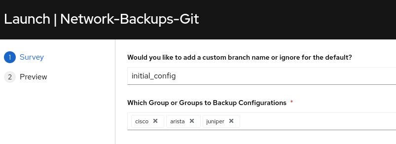
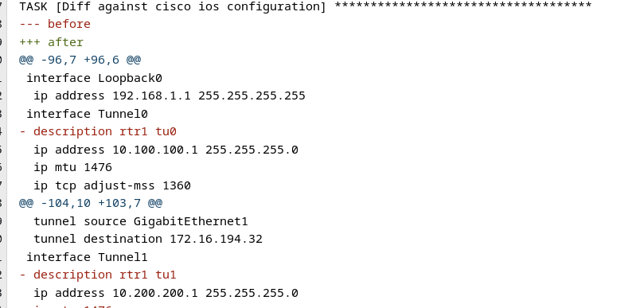
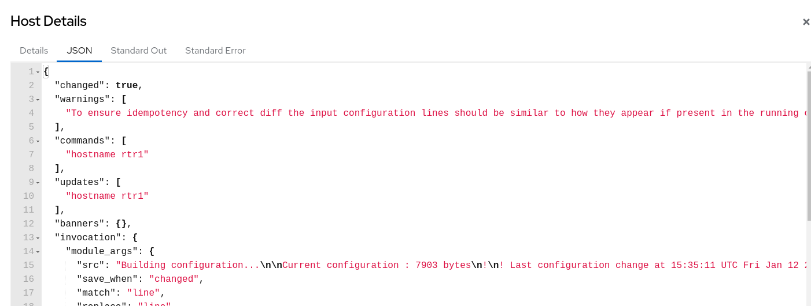

## Return to Menu
 - [Menu of Exercises](../README.md)

# Exercise-8 Config Drift Restore

[Table of Contents](#table-of-contents)
- [Step 1 - Create another backup](#step-1---create-another-backup)
- [Step 2 -  Launch the Network-Intended Job-template](#step-2---launch-the-network-intended-job-template)
- [Step 3 - Launch the Network-Intended Job-template](#step-3---launch-the-network-restore-job-template)
- [Step 4 - Inspect the rtr1 stdout-json output](#step-3---inspect-the-rtr1-stdout-json-output)

## Overview
In this exercise we will compare and restore our changes made since Exercise-1, versus the backup file(s) saved from each router in the Gitea repository. By using the saved router configurations from the `initial_config` branch we can detect that the router configuration has drifted away from our single source of truth as understood by Ansible.

### Step 1 - Create another backup
Return to Exercise 1 and rerun the 'Network-Backups-Git' job template. The survey will prompt for optionally naming your branch or inserts default branch naming when ignored. For this exercise, when prompted, name your backup branch `final_config`

### Step 2 - Launch the Network-Intended Job-template
Upon lauching the job-template the self service survey will prompt for information.

1. Select the `initial_config` branch from the dropdown. You must also select the groups of devices to run the config drift check against. Go ahead and select all three.

 

 2. Review the output to understand the Diff entries
 Your output may vary. 

# Network Restore GIT

## Overview
In this exercise we have a backup file(s) saved for each router in the Gitea repository. We will now run the Network Restore job-template and select the same backup branch from the previous "Network Intended" job. This will render a backup restore by merging the backup file to the group/device(s) that were detected to have configuration drift (DIFF).

### Step 3 - Launch the Network-Restore Job-template
Ensure that you select the `initial_config` backup branch as used in the `Exercise-1`.

Output
~~~

TASK [Clone a Repo to EE] ******************************************************
changed: [rtr1 -> localhost]
TASK [push configs to devices] *************************************************
changed: [rtr1]
TASK [push configs to devices] *************************************************
ok: [rtr2]
ok: [rtr4]
TASK [push configs to devices] *************************************************
changed: [rtr3]
PLAY RECAP *********************************************************************
rtr1                       : ok=2    changed=2    unreachable=0    failed=0    skipped=2    rescued=0    ignored=0   
rtr2                       : ok=1    changed=0    unreachable=0    failed=0    skipped=2    rescued=0    ignored=0   
rtr3                       : ok=1    changed=1    unreachable=0    failed=0    skipped=2    rescued=0    ignored=0   
rtr4                       : ok=1    changed=0    unreachable=0    failed=0    skipped=2    rescued=0    ignored=0   
~~~

This time the restore.yml playbook is configured to push the config backup files to change `overwrite` the configurations with the remote devices. 

### Step 4 - Inspect the rtr1 stdout-json output

SSH to rtr1 and optionally rtr2-4 to validate the configurations changed back to the original.

### Optional
If desired you could also restore to the `final_config` by rerunning this exercise.

# Key Takeaways
* The intended config compares diffs between the chosen backup and the device's running configuration.
* When configuration drift (diff) is detected, then a backup configuration can be pushed back to the device for a configuration overwrite to restore.
* You can restore to any of your previous backups.

## Return to Exercise Menu
 - [Menu of Exercises](../README.md)