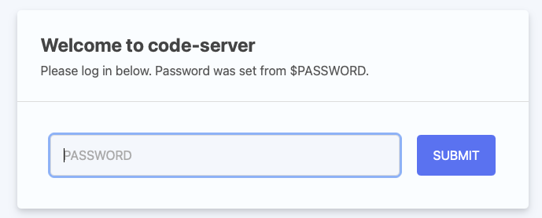
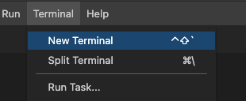
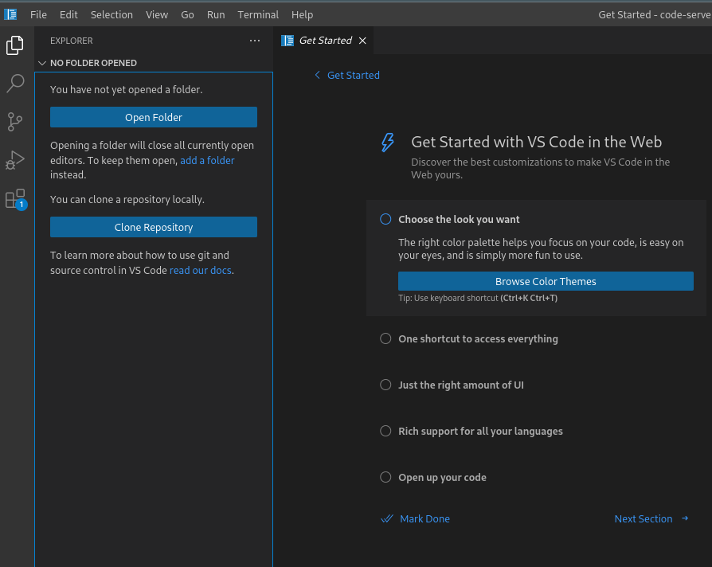

# Multi-Vendor Network Automation 
 The Multi-Vendor Network Automation training offers five hours of use case based training to become familiar with using the Ansible Automation Platform (AAP) for Network automation. This repository includes eight "immersive" network automation exercises. This training is designed to enhance your team’s knowledge, skills, and confidence with using Ansible Automation Platform (AAP) for networks.

## What this training is
The main focus of this workshop is to automate real world use cases using the power and capabilities of the Ansible Automation Platform. 

## What this training is not
This training is not focused on extensive playbook development. Although we examine existing playbook content and best practices, there are minimal modifications. 

### Other options for more `playbook` focused development
1. Network Automation 101 workshop
https://labs.demoredhat.com/webpages/network

2. Network Automation advanced workshop
https://github.com/mglantz/advanced-networking-workshop/tree/main?tab=readme-ov-file

## Slides
https://gitlab.com/redhatautomation/multi-vendor-network-workshop/-/blob/main/Ansible_Multi-Vendor-Workshop.pdf?ref_type=heads

## Accessing the Multi-Vendor Network Automation 
Please note, the lab pods for these exercises can be accessed on your behalf by Red Hat employees. 

Ask your RH account representative to schedule an instuctor to make a RHDP reservation for an aap2-workshop-networking-automation POD https://demo.redhat.com/catalog?search=network&item=babylon-catalog-prod%2Fansiblebu.aap2-workshop-networking-automation.prod

## RHDP Lab POD Details
During the workshop your instructor will provide a link similar to the following:
~~~
http://jxqdn.example.opentlc.com
~~~
You will be prompted for your name and email address. Afterwards, your browser is redirected to your workbench.


Note, the password is the same for ssh, VSCode, and the Ansible Controller. Remember to leave this browser tab open incase you need to copy the password again at various exercises throughout the duration of the workshop.

Upon receiving a student workbench, please scroll down directly to the `Exercise 0 Getting Started` steps or click below.
- [Exercise 0 Getting Started](#exercise-0-getting-started)

## Menu of Exercises
For the below demos ensure you are always using files from /home/student/network-demos-repo/
- [1-Backups As Code](1-backups_as_code/README.md)
- [2-Network Compliance Dashboard](2-network_compliance_dashboard/README.md)
- [3-Network Compliance Checks Remediations](3-network_compliance_checks_remediations/README.md)
- [4-Multivendor Validated Content (BGP)](4-multi_vendor_validated_content_bgp/README.md)
- [5-Brownfield Switches Resource Modules](5-brownfield_switches_resource-modules/README.md)
- [6-Network Upgrade As Code](6-network_upgrade_as_code/README.md)
- [7-Tuning For Scale](7-tuning_for_scale/README.md)
- [8-Config Drift Restore](8-config_drift_restore)

# Exercise 0 - Getting Started

## Exercise 0 - Setting up the Gitea Repo and VSCode

## Table of Contents

- [Exercise 1 - Setting up the Gitea Repo and VSCode](#exercise-1---seting-up-the-gitea-repo-and-vscode)
  - [Table of Contents](#table-of-contents)
  - [Objective](#objective)
  - [Diagram](#diagram)
  - [Guide](#guide)
    - [Step 1 - Connecting via VS Code](#step-1---connecting-via-vs-code)
    - [Step 2 - Using the Terminal](#step-2---using-the-terminal)
    - [Step 3 - Deploy Gitea on the Control Node](#step-3---deploy-gitea-on-the-control-node)
    - [Step 4 - Open the project directory in Visual Studio Code](#step-4---open-the-project-directory-in-visual-studio-code)
    - [Step 5 - Create and check in to your repo](#step-5---create-and-check-in-to-your-repo)

## Objective

This exercise will set up your environment for the remaining exercises included in this repository. This exercise includes steps to set up a version control system, which is used to track and provide control over changes made to the automation code. Version control (sometimes called source control) plays an important role in any development project, including automation development.

## Diagram
The lab topology includes the following routers:
- rtr1 (cisco ios-xe) 
- rtr2 (arista eos)
- rtr3 (juniper junos)
- rtr4 (arista eos)


## Guide

### Step 1 - Connecting via VS Code

<table>
<thead>
  <tr>
    <th>You must use Visual Studio Code to setup the demos. Visual Studio Code provides:
    <ul>
    <li>A file browser</li>
    <li>A text editor with syntax highlighting</li>
    <li>A in-browser terminal</li>
    </ul>
    Direct SSH access is available as a backup, or if Visual Studio Code is not sufficient to the student.  There is a short YouTube video provided if you need additional clarity: <a href="https://youtu.be/Y_Gx4ZBfcuk">Ansible Workshops - Accessing your workbench environment</a>.
</th>
</tr>
</thead>
</table>

- Connect to Visual Studio Code from the Workshop launch page (provided by Red Hat RHDP).  The password is provided below the WebUI link.

  

- Type in the provided password to connect.

  


### Step 2 - Using the Terminal

- Open a terminal in Visual Studio Code (VSC):

  

### Step 3 - Deploy Gitea on the Control Node

We are going to run our first playbook here, which will deploy a Gitea server in a container on the control node (ansible-1).

In the VSC terminal, use wget to download the gitea.yml file, and then use `ansible-navigator` to run the playbook.
```
wget https://gitlab.com/redhatautomation/multi-vendor-network-workshop/-/raw/main/gitea/gitea.yml
```
You can run the ansible-navigator command with low verbosity, or if you want to see more of what Ansible is doing, you can add `-v` (up to 4 v's) to the ansible-navigator command.
```
ansible-navigator run -m stdout gitea.yml 
```
Running the gitea.yml playbook will output to the terminal all of the tasks that are done to deploy the Gitea container, configure it for use in the environment, and setup the network-demos-repo that we will be working from. When the playbook has finished running, you should be able to update your VSCode window and change into the network-demos-repo directory and run git status to see that we are up today.


### Step 4 - Open the project directory in Visual Studio Code

Click on the files icon in the upper right corner of your Visual Studio Code window, and click `Open Folder`.



In the pop-up window, choose the `/home/student/network-demos-repo` folder, and select `OK`.

## Step 5: Controller as Code
1. If not already there, ensure there is a terminal window open to the `network-demos-repo/0-controller_as_code` directory 

1. Open a new CLI terminal


### Step 6 - Run Playbook 
The setup.yml playbook will require extra variables when running in ansible-navigator.

- The CONTROLLER_PASSWORD in setup.yml is the same password assigned to your RHDP student POD for the Ansible Controller

Run the `ansible-navigator` command with the `run` argument and -m stdout as well as  -e for the `--extra-vars`

  ~~~
  ansible-navigator run 0-controller_as_code/setup.yml --eei registry.gitlab.com/redhatautomation/validated-network-ee:latest -m stdout -e "username=gitea git_password=gitea password=<replace-with-lab-student-password>"
  ~~~

#### Output "truncated"
The first run will show 'changed'
```bash
PLAY [Playbook to configure ansible controller] ********************************

TASK [Gathering Facts] *********************************************************
ok: [localhost]

TASK [Create projects] *********************************************************
ok: [localhost]

TASK [Add group] ***************************************************************
ok: [localhost]

TASK [Add group] ***************************************************************
ok: [localhost]

TASK [Add group] ***************************************************************
ok: [localhost]

TASK [Create Execution Environments] *******************************************
ok: [localhost]

TASK [Gitea Credential Type] *******************************************************
ok: [localhost]

 TASK [Gitea Credential] *******************************************************
ok: [localhost]
```
### Step 7 Access the AAP Controller

Access your AAP from the https://xxxxx.example.opentlc.com/ link. 
- Your link is included with the RHDP pod information.

Your AAP Controller should now include the job-templates etc for the menu of demos. You can now select a demo from the Menu of Demos and follow the specific directions in the README.md.

## Return to Demo Menu
 - [Menu of Exercises](#menu-of-exercises)

